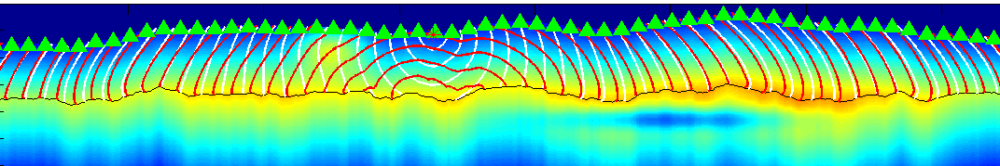
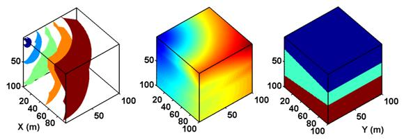

# PFAST: A High Performance Software Package for Transmission and Reflection Seismic Traveltime Tomography

## Summary

PFAST is the abbreviation of Parallel Fast sweeping method based Adjoint Seismic Tomography. This document provides the basic tutorial for users to quickly start using the program (PFAST)

1. to obtain traveltime in 2-D/3-D arbitrarily heterogeneous isotropic models,

2. to perform conventional first-arrival traveltime tomography in 2-D/3-D,

3. to perform reflection-arrival tomography in 2-D (for version 1.1), and

4. to perform joint tomography using both first and reflection arrivals in 2-D (for version 1.1).

The essential algorithm of PFAST is based on 3 ingredients:

(a) Fast-sweeping method (FSM), a grid-based Eikonal equation solver,

(b) Huygens’ Principle to calculate reflection traveltime using FSM, and

(c) The adjoint method, to obtain the gradient of the non-linear objective function without time consuming evaluation of Fréchet derivative matrix.

The details of the theory can be found in a paper published in Geophysical Journal International (Huang and Bellefleur, 2012) and one application to the arctic permafrost region with complex near surface thermokarst lakes (Huang and Bellefleur, 2011).

Currently PFAST supports joint tomography in 2-D isotropic model and diving wave tomography in 3-D isotropic models. Future development includes implementation of the joint tomography algorithm in 3-D models and extension of the FSM to handle irregular meshes and anisotropic velocity models.

The source codes are written primarily in C (a little bit of C++ function overload) with MPI support. The codes have been tested successfully using OpenMPI v1.4.3 on Ubuntu 11.04. Matlab TM scripts are provided to generate the models and visualize the results. All mfiles were created on Matlab 7.12 (R2011a) and should be compatible to other versions.

The codes are grouped into one main program file and two header files, one including FSM related subprograms and one adjoint method related subprograms.

MatlabTM scripts to generate models and view results are distributed with the software package.

To build this program one only needs to compile the three source files. Advanced users who may need to alter the codes are encouraged to save subprograms into individual files and create a makefile to build the software. An introduction of creating a makefile can be found at GNU Operating System website.

## References

Huang, J.W., and Bellefleur, G., 2011, Joint Transmission and Reflection Traveltime Tomography in Imaging Permafrost and Thermokarst lakes in Northwest Territories, Canada, The Leading Edge.

Huang, J.W., and Bellefleur, G., 2012, Joint Transmission and Reflection Traveltime Tomography using the Fast Sweeping Method and the Adjoint-state Technique, Geophysical Journal International.